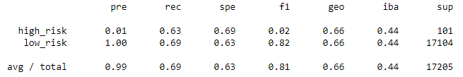
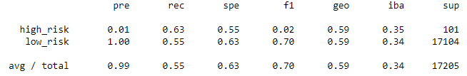
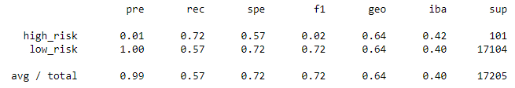
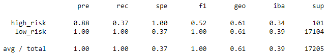

# Credit_Risk_Analysis

## Overview of the Analysis
The purpose of this analysis is to ascertain the effectiveness of a variety of supervised machine learning models in predicting the risk of individuals submitting credit applications. 

## Results

Naive Random Oversampling

SMOTE

Undersampling

Combination Sampling 

Random Forest Classifier

Easy Ensemble AdaBoost Classifier

## Summary
