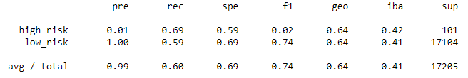

# Credit_Risk_Analysis

## Overview of the Analysis
The purpose of this analysis is to ascertain the effectiveness of a variety of supervised machine learning models in predicting the risk of individuals submitting credit applications. 

## Results
The results for this analysis can be summarized as follows: 
- All models, except the Random Classifier model, are showing incredibly low precision for high risk individuals.
- The Easy Ensemble AdaBoost Classifier model has the best sensitivity calculation for both low and high risk datapoints of the model options. 
- Overall, the models struggled to accurately identify high risk individuals, per F1 score. The model with the highest F1 score for high risk individuals is the Random Forest Classifier. 

The confusion matrix for each type of supervised learning that was utilized on the credit risk dataset can be visualized below: 
**Naive Random Oversampling**

**SMOTE**

**Undersampling**

**Combination Sampling** 

**Random Forest Classifier**

**Easy Ensemble AdaBoost Classifier**

## Summary
It is difficult to recommend a model for this analysis because of how poorly the high risk data was fit with nearly all models. In the interest of ensuring a credit company does not take on undue risk, sensitivy or recall for high-risk applicants is a more important metric. A high sensitivity means that individuals that are high risk are identified correctly. Utilizing this logic, it is recommended that the Easy Ensemble AdaBoost Classifier is used to model this dataset. The Easy Ensemble Classifier has the best sensitivity score for high-risk inidividuals and has an F1 score that is only marginally lower (0.03 lower) than the Random Forest Classifier. 

However, none of the models fit the data particularly well. The Easy Ensemble Classifier's higher sensitivity score comes with an incredibly low precision calculation. This signifies that the model is "over classifying" data points as high risk.

In order to create models that better fit and predict data points, narrowing down the columns may be a strategy to reduce overfitting and improve the fit of all of these models. It is possible that some of the columns in the data are less relevant to predicting credit risk than others.  
